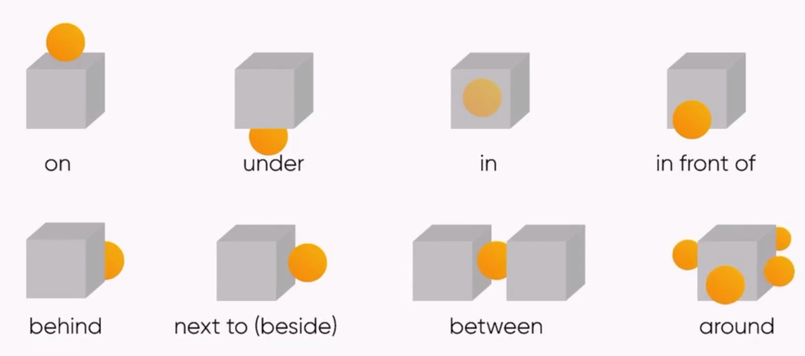

# 介词

介词 (介词 prep.) 在句子中起着中介或连接作用，且表示前后两者之间的关系的词，常用于表达时间、地点、方向等。

## 时间介词

::: tip 口诀

| 介词 | 表示时间段                           | 口诀                                     |
| ---- | ------------------------------------ | ---------------------------------------- |
| in   | >1 天 泛指较长时间段                 | in 年 in 月 in 季节 ; 上午下午晚上表泛指 |
| on   | =1 天 具体某一天或某一天的某个时间段 | on 日 on 号 on 修饰具体某一天            |
| at   | <1 天 具体的时间点                   | at 加时间点 ; 午夜/黄昏/黎明表具体       |

:::

### in

- in the 21st century (在 21 世纪)
- in 2010 (在 2010 年)
- in October (在 10 月)
- in summer (在夏天)
- in the morning (在早晨)
- in the afternoon (在晚上)
- in the evening (在晚上)

### on

- on Monday (在星期一)
- on Monday afternoon‌ (在星期一下午)
- on the weekend (在周末)
- on October 1st (在 10 月 1 日)
- on New Year's Day (在新年当天)
- on my birthday (在我的生日)
- on a cold morning (在寒冷的早上)
- on the first day of the month (在当月的第一天)

### at

- at 3 o'clock (在三点钟)
- at daybreak/dawn (在黎明)
- at noon (在中午)
- at dusk (在黄昏)
- at night (在晚上)
- at midnight (在午夜)
- I wake up at twilight. (我在霞光中苏醒)

> **at + 比较抽象的时间点**  
> I will go to Japan **at** <u>the beginning of September</u>. 我将在<u>九月初</u>的时候去日本。 
> I will come back **at** <u>the end of September</u>. 我将在<u>九月末</u>的时候回来。

::: tip 是否加 the ?

- on Monday 不加 the，因为星期几是明确的时间单位 ;  
- on the weekend 加 the，因为周末是一个更广泛的时间段，需要通过 the 来限定。

举一个例子(其余的同理~)
:::

**对比记忆**

| 中文       | 英文             |
| ---------- | ---------------- |
| 在清晨     | at daybreak/dawn |
| 在上午     | in the morning   |
| 在中午     | at noon          |
| 在下午     | in the afternoon |
| 在黄昏时分 | at twilight      |
| 在晚上     | in the evening   |
| 在夜里     | at night         |

### during

- during + 用于**已知的**一段时间 , 包括大家熟知的节日或者某种已确切限定的时期或阶段之前。

  I traveled around the city during the first year of college. (特定期间)  
  We had a good time during the summer holiday. (特定期间)  
  I go shopping during the Christmas season. (熟知的节日)  
  I work during the holidays. (特定期间)  

### for

- for + **非特定**一段时间 , 强调的是某个动作持续了多久,长达多少时间。

  He lived in Macao for five days. 他在澳门住了五天。  
  He will study abroad for two months. 他将在国外游学两个月。  
  I stayed home for a week. 我在家里待了一周。  
  I worked for eight hours. 我工作了八小时。  

::: info 练习题

We have a meeting **\_\_\_\_** January.

Many people go to Sanya **\_\_\_\_** the winter holiday. 许多人在寒假时去三亚。

I get up **\_\_\_\_** 9:00 **\_\_\_\_** the summer holiday. 在暑假期间我九点起床。

My exam is **\_\_\_\_** Friday and it will last **\_\_\_\_** 2 hours. 我的考试在周五，并且它会持续两小时。

:::

## 空间介词

- on 在...上面 (有接触)
- under 在...正下方 (强调垂直)
- in 在...内部
- in front of 在...前面 (外部)
- behind 在...后面
- beside/next to 在....旁边
- between 在...之间 (两者)
- around 围绕

**above 任意上方 over 正上方**

The clouds are above the mountains.(云在山的上方。) 
The bridge is over the river.(桥在河上。)

**below 任意下方 under 正下方**

The plane flew below the clouds. (飞机在云层下方飞行。) 
The cat is sleeping under the table. (猫正在桌子底下睡觉。)

**over 主动覆盖 / under 被动覆盖**

I put a blanket **over** him. (我给他盖了条毯子。) 
You can put plastic wrap **over** the bowl. (你可以把保鲜膜盖在碗上。) 
The cat was hidden **under** the blanket. (猫藏在毯子下面。) 
The keys are **under** the newspaper. (钥匙被压在报纸下面)

**in front of 在外部前面 / in the front of 在内部前面**

The square is standing in front of the museum. (广场位于博物馆前。) 
We are sitting in the front of the bus. (我们坐在公交车前面。)

## 地理位置

**in** ： 范围可可小,侧重在...内部

- in China
- in Shanghai
- in a room
- in the classroom

**on** : 表示“在……表面上” 或 “在某区域边缘/线上”

- on the table (在桌子上表面接触)
- on Nanjing Road 在南京路上
- on the 7th floor 在 7 楼

**at** : 小范围 , 表示“在某个具体点位“

- at the table (在桌子旁)
- at school
- at the airport 在机场
- at 37, Nanjing Road

## 交通工具

- **in + 修饰词 + 交通工具** (小车) : 在较小的交通工具内部

  **in a car / taxi / boat...**

- **on + 修饰词 + 交通工具** (大车) : 在较大的交通工具上

  **on a bus / train / subway ...**

- **on + 骑行工具**

  **on foot (步行) / on my bike (骑自行车) / on my motorcycle (骑摩托车) / on the skateboard (滑板)**

> "钻"进去只能"坐"着的用 **in** , "登"进去可以"站"着的用 **on** (on 更强调出在行进的动作)

## 家具

- on the chair 在椅子上(硬的)
- in the sofa 在沙发上(软的)
- on the bed 在床上(不盖被子)
- in the bed 在床上(被窝里)
