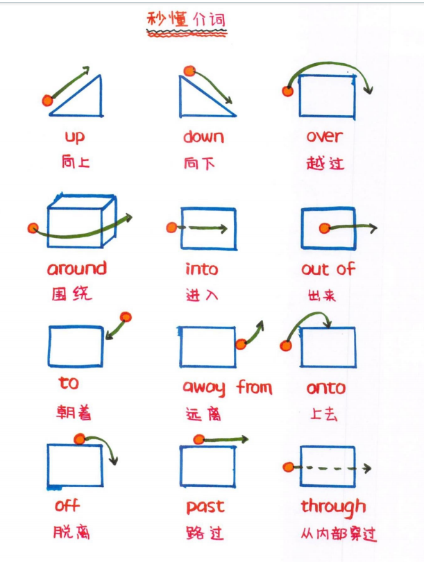
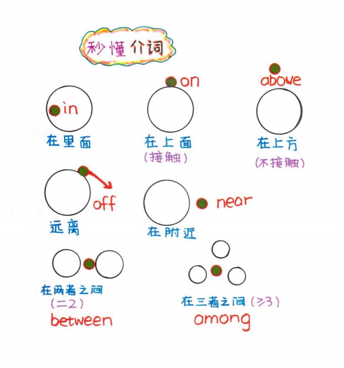
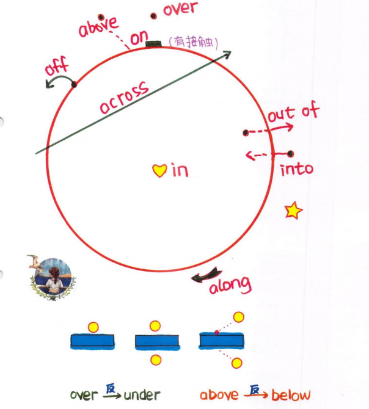

# 介词

介词 (介词 prep.) 在句子中起着中介或连接作用，且表示前后两者之间的关系的词。

**黄金三原则**

- **介词在句中不可单独做谓语**

  I will meet you in the park. --> I<主语> will meet<谓语> you<宾语> **in** the park<介宾短语>

- **介词 + 名词、动名词、代词** (介词三宝)

  She is waiting <u>**for** the bus.</u> ---> 介词 + 名词  
  He is good <u>**at** playing basketball.</u> ---> 介词 + 动名词  
  Can you help me <u>**with** this problem?</u> ---> 介词 + 代词  

- **地点副词前无介词** (here、there、upstairs、downstairs、home、abroad)

  I will <u>be there</u> at 5 o'clock.  
  I woke up at 6 o'clock and <u>went downstairs</u> to make breakfast.

**介词绝缘体**

这些词汇本身就是时间或位置的标志，因此通常不需要再加介词来修饰。

| 介词绝缘体    | 例子                | 介词绝缘体  | 例子       |
| ------------- | ------------------- | ----------- | ---------- |
| **this**      | This morning        | **that**    | That night |
| **last**      | Last week           | **next**    | Next month |
| **every**     | Every day           | **each**    | Each year  |
| **yesterday** | Yesterday afternoon | **today**   | Today      |
| **tomorrow**  | Tomorrow evening    | **tonight** | Tonight    |

## 时间介词

::: tip 口诀

- **in > 1 天 表示较长的时间段 ; <u style="color:red">in 年 in 月 in 季节 ; 上午下午晚上表泛指</u>**
- **on = 1 天 表示具体某一天或某一天的某个时间段 ; <u style="color:red">on 日 on 号 on 修饰</u>**
- **at < 1 天 <u style="color:red">at 要加时间点 ; 午夜黄昏黎明表具体</u>**

:::

### in

- in the 21st century (在 21 世纪)
- in 2023 (在 2023 年)
- in June (在六月)
- in summer (在夏天)
- in the morning (在早晨)
- in the afternoon (在晚上)
- in the evening (在晚上)

### on

- on Monday (在星期一)
- on the weekend (在周末)
- on Sunday afternoon‌ (在星期日下午)
- on June 15th (在 6 月 15 日)
- on New Year's Day (在新年当天)
- on my birthday (在我的生日)
- on a cold morning (在寒冷的早上)
- on the first day of the month (在当月的第一天)

> on Monday 不加 the，因为星期几是明确的时间单位 ;  
> on the weekend 加 the，因为周末是一个更广泛的时间段，需要通过 the 来限定。

### at

- at 3 o'clock (在三点钟)
- at noon (在中午)
- at night (在晚上)
- at midnight (在午夜)
- at dusk (在黄昏)
- at dawn (在黎明)
- I wake up at twilight. (我在霞光中苏醒)

### during

- during + 用于已知的一段时间 , 包括大家熟知的节日或者某种已确切限定的时期或阶段之前。

  She lived in Nanjing during the 90s.(特定期间)  
  We had a good time during the summer holiday.(特定期间)  
  I go shopping during the Christmas season.(熟知的节日)  
  I work during the holidays.(特定期间)  

### for

- for + 非特定一段时间

  He lived in Hongkong for five days.  
  He will go abroad for two months.  
  I stayed home for a week. 我在家里待了一周。  
  I worked for eight hours. 我工作了八小时。  

**例句 :**  
In September, on the Mid-Autumn Festival, at night, we sit under the moonlight and enjoy delicious moonCakes. (在九月，中秋节那天晚上，我们坐在月光下品尝美味的月饼。)  
On a cold morning in the winter, at 6 o'clock on the weekend, I wake up early to go for a run in the park. (在一个冬天的寒冷早晨，周末的 6 点钟，我早早起床去公园跑步。)  

## 乘交通工具

- **by + 交通工具** : 表示一种通用的方式

  **by bus / train / plane / bike / car / subway / scooter ...**

  I go to school by bus.（我乘公交车去学校。） 
  She travels to New York by plane.（她乘飞机去纽约。）

- **take + 修饰词 + 交通工具** : 具体的某一次乘坐行为

  **take a bus / car / ship / train / taxi / boat / motorcycle / subway ...**

  I will take a bus to the school.（我将乘一辆公交车去学校。） 
  He takes the subway to work every day.（他每天乘地铁去上班。）

- **in + 修饰词 + 交通工具** (小车) : 在较小的交通工具内部

  **in a car / taxi / helicopter / boat / motorcycle / scooter**

- **on + 修饰词 + 交通工具** (大车) : 在较大的交通工具上

  **on a bus / train / subway / ship / plane / skateboard / roller skates ...**

- **两个特殊的**

  **on foot (步行) / on my bike (骑自行车)**

> "钻"进去只能"坐"着的用 **in** , "登"进去可以"站"着的用 **on**

## 方位介词

- **里面 in , 上面 on , at 在某点上**

  **in : 在某个范围内 , in + 大地点(>= 区)**

  in Beijing 、in the US 、in China 、 in Asia  

  **in : 强调在建筑内部**

  in home 、 in the supermarket 、in the classroom

  **in : 表示抽象概念中的“在...中”**

  in marriage 在婚姻中 、 in life 在生命中、 in a circle 在圆圈中

  **on 用于接触面** ：on the table、on the floor 、on the wall  

  **at + 小地点(小于区)** ： at school、at the airport、at No.10 Downing Street  

  **by : 在什么旁边** ：by the window

- **方向 ：来自 from、朝着 to**

  I am from China.（我来自中国。） 
  I am going to the park.（我要去公园。） 

- **区域介词：in 、on 、to**

  **in 区域内部**

  Beijing is <u>in</u> the north of China.（北京中国北部。） 
  TaiWan is <u>in</u> the south of China.（台湾中国南部。）--> （政治上属于中国要用 in）

  **on 相邻接壤**

  Russia is <u>on</u> the north of China. （俄罗斯在中国的北边。）

  **to 不相邻不接壤**

  Japan is <u>to</u> the east of China. = Japan is east of China.（日本在中国的东边。）

## 位置介词

- **正上下方 over 、 under**

  The bridge is over the river.（桥在河上。）  
  The keys are under the table.（钥匙在桌子下面。）

- **相对上下方 above、below** ; 强调的是相对高度，不一定是在正下方

  The clouds are above the mountains.（云在山的上方。）  
  The sun sank below the horizon. （太阳落到了地平线下。）

- **前后位置** ：**in front of 、in back of/behind (在...前/后面)**

  The car is in front/back of the house. (汽车在房子前面。)  
  The dog is behind the fence. (狗在篱笆后面。)  

- **in (在...里面)** 和 **out (在...外面)**

  The book is in the bag. (书在包里。)  
  The children are out playing. (孩子们在外面玩。)  

- **near (靠近)** 和 **away from (远离)**

  The park is near the school. (公园靠近学校。)  
  The house is far away from the city. (房子远离城市。)  

- **inside (在里面)** 和 **outside (在外面)**

  She is inside the room. (她在房间里。)  
  The garden is outside the house. (花园在房子外面。)  

- **between (在两者之间)** 和 **among (在多者周围)**

  The house is between two trees. (房子在两棵树之间。)  
  He walked among the trees, enjoying the fresh air. ( 他在树丛中散步，享受着新鲜空气。)

## 动作关系

- **up (向上)** 和 **down (向下)**

  Go up the stairs. (上楼。)  
  Come down the ladder. (从梯子上下来。)  

- **into (进入)** 和 **out of (从...出来)**

  The car drove into the garage. (汽车开进了车库。)  
  The cat came out of the box. (猫从盒子里出来了。)  

- **穿过 through、横过 across、越过 over**

  through ： 空的 (管道) / 立体 (树林、人群) / 障碍物 (门、窗、墙、阳光、信号) 
  across 强调从一端到另一端 : street / road / bridge ... 
  over 强调从上方越过, 有覆盖和支撑的意思 , 是否表示接触取决于具体的上下文 

  We walked through the forest.（我们穿过森林。） 
  She walked across the street.（她走过街道。） 
  The plane flew over the mountain.（飞机越过了山。） 
  She put a blanket over the baby.（她把毯子盖在婴儿身上。）  

- **around (围绕) 、along (沿着)、past (路过)**

  The children play around the tree. (孩子们在树周围玩耍。)  
  They walked along the beach. (他们沿着海滩走。)  
  She walked past the store. (她路过商店。)  

- **off 脱离 、 onto (到...上)**

  He jumped off the chair. (他从椅子上跳下来。)  
  He jumped onto the chair. (他跳到椅子上。)  

## 易混淆介词区分

###### 在上方

- above 在...上方 (不强调垂直)
- over 在...正上方 (强调垂直)
- on 在...上面 (有接触)

###### 在下方

- below 在...下方 (不强调垂直)
- under 在...正下方 (强调垂直)
- beneath 在...下面 (有接触)

###### 在前面

- in front of 在...前面 (外部)
- in the front of 在...前面 (内部)

###### 在...之间

- between 在...之间 (两者)
- among 在...之间 (>= 三者)

###### 在...边

- beside 在....旁边
- behind 在...后面
- near 在...附近

###### 穿过越过路过

- through 内部穿过
- across 表面穿过;横过
- over 从上方越过
- past 路过

###### 离开

- off 从一个物体或位置上脱离 ，通常涉及从表面或位置上的分离
- away from 从一个地方或物体逐渐远离，强调距离的增加，逐渐远离的过程

## 介词区分妙招

###### 在... 上 on / in

in the tree ：后来到树上的 ( i 像钉子 ，不能长在树上 ) 
on the tree ：长在树上面的 ( O 像果子 ，长在树上 ) 

in the wall ：镶嵌在墙里 ( i 像钉子 ，入墙里 ) 
on the wall ：在墙表面上 ( O 像钟表 ，挂在墙上 ) 

in the newspaper ：报纸上的内容 
on the newspaper ：放在报纸上的东西 

be made of ：由...制成的 (看得出来原材料) ; The coat is made of wool. 
be made from : 由...制成的 (看不出来原材料) ; Wine is made from grapes.  

###### 身上介词

in + 身上穿的衣物 (衣服、颜色、帽子、款式、尺码 )  
with + 除了身上衣物以外的 (五官、首饰、配饰、伤疤、胎记)  

in a red dress / in a large-sized T-shirt  
with to big eyes / with a pair of glass  

###### 不是一个 to

- **介词 to + (名词、动名词、代词)**

  be used to doing 习惯做某事  
  look forward to doing 盼望做某事  
  prefer doing A to doing B 比起 B 更喜欢做 A 

- **不定式 to 后 + (动词原形)**

  used to do 曾做过某事 (现在不做了) 
  be used to do 被用来做某事 (被动语态) 

###### on/off 多种形态

- **表示位置** ：**on 在...上 ; off 从...上下来**

  Put the book on the shelf. (把书放在书架上。)  
  Take the book off the shelf. (把书从书架上拿下来。)  

- **表示开关状态** ：**on 打开 ; off 关闭**

  The fan is on. (风扇开着) / The fan is off. (风扇关着)  

- **表示活动状态** : **on 进行中 ; off 停止**

  The concert is on this weekend. (音乐会在这个周末举行。)  
  The concert is off because of bad weather. (因为天气不好，音乐会取消了。)

## 练习题

1.  The conference will be held **\_\_\_\_\_** March.
2.  The meeting is scheduled **\_\_\_\_\_** 3:00 PM.
3.  We will meet **\_\_\_\_\_** the weekend.
4.  The party is planned **\_\_\_\_\_** July 15th.
5.  The project will be completed **\_\_\_\_\_** six months.
6.  The package was sent **\_\_\_\_\_** Shanghai.
7.  The students are traveling **\_\_\_\_\_** London for their summer exchange program.
8.  The university is located(位于) **\_\_\_\_\_** the city.
9.  The town is situated(位于) **\_\_\_\_\_** the coast(海岸).
10. Canada is **\_\_\_\_\_** the north of the United States.
    > 答案 ： in | at | on | on | in | from | to | in | on | to
11. The airplane is flying **\_\_\_\_\_** the clouds.
12. The cat is hiding **\_\_\_\_\_** the bed.
13. The stars are shining **\_\_\_\_\_** the moon.
14. The roots of the tree are **\_\_\_\_\_** the soil.
15. The square is standing **\_\_\_\_\_** the museum. (在...前面)
16. The teacher stood **\_\_\_\_\_** the classroom to give the lecture(讲课).
17. The children are playing **\_\_\_\_\_** the house. (在...外面)
18. The children were playing **\_\_\_\_\_** the house. (在...后面)
19. The letter is **\_\_\_\_\_** the envelope.
20. The flowers are blooming **\_\_\_\_\_** the garden.
    > 答案 : over | under | above | below | in front of | in the front of | outside | behind | in | in
21. The treasure(地图) map was hidden **\_\_\_\_\_** the old chest(箱子).
22. The picture is hanging(悬挂) **\_\_\_\_\_** the two windows. (在两个窗户之间)
23. The small town is located **\_\_\_\_\_** the mountains. (坐落于群山之间)
24. The students walked **\_\_\_\_\_** the classroom when the bell rang.
25. She took the book **\_\_\_\_\_** her bag and started reading.
26. He climbed **\_\_\_\_\_** the hill to get a better view.
27. She walked **\_\_\_\_\_** the stairs to the basement(地下室).
28. She got **\_\_\_\_\_** the bus at the next stop.
29. The park is **\_\_\_\_\_** the school, so many students go there during lunch break.
30. The noise from the construction site(施工现场) made it difficult to concentrate(集中注意力), so we moved our desks **\_\_\_\_\_** the window.
    > 答案 : inside/in | between | among | into | out of | up | down | off | near | away from
31. The river flows **\_\_\_\_\_** the forest.
32. The hikers walked **\_\_\_\_\_** the bridge to reach the other side.
33. The cat jumped **\_\_\_\_\_** the fence.
34. The cat jumped **\_\_\_\_\_** the table.
35. The tourists walked **\_\_\_\_\_** the old town, admiring(欣赏) the historic buildings.
36. The car drove **\_\_\_\_\_** the house and stopped in the driveway.
    > 答案 : through | across | over | onto | around | past

## in, with, to

in, with, to 的用途非常广泛 , 在此列举了一下常用例子

**in** : 表示位置、时间、方式、状态等

- 位置 : He lives in the city.
- 时间 : We will finish the project in a week.
- 方式 : She wrote a letter in English.
- 状态 : He is in work.

**with** : 表示伴随、工具或手段、特征、原因等

- 通过/使用 ： Can you pay with cash?
- 跟...一起 : I usually go shopping with my friends.
- 搭配 : They have eggs with milk.
- 工具或手段 : She paid the bill with her phone.
- 特征 : He is wearing a red shirt with a tie.
- 原因 : He can't come with a cold.

**to** : 表示方向、目的、接收者、动作的趋向

- 方向 : He went to Beijing.
- 目的 : She studies to pass the exam.
- 接收者 : She gave the gift to her friend.
- 动作的趋向 : She moved to the table.

## 常用介词组合

| 介词      | 释意                 | 例子                       | 例子翻译         |
| --------- | -------------------- | -------------------------- | ---------------- |
| **of**    | ...的                | a friend of mine           | 我的一个朋友     |
|           | 由...组成            | be made of milk            | 由牛奶制成       |
|           | 种类、数量           | ten kilos of iron          | 十公斤的铁       |
|           | 由于、因为           | die of                     | 死于             |
| **for**   | 当成、作为           | for supper                 | 作为晚餐         |
|           | 原因、理由           | Thank you for helping me   | 谢谢你帮我       |
|           | 给...、为...         | Here is a letter for you.  | 这是一封给你的信 |
|           | 计、达               | for two days               | 共计两天         |
|           | 目的                 | for a walk                 | 去散步           |
|           | 支持、赞成           | be for you                 | 支持你           |
| **from**  | 从...来              | come from China            | 来自中国         |
|           | 分离                 | fell from the tree         | 从树上掉下       |
|           | 禁止、解除           | be safe from danger        | 脱离危险         |
|           | 不在、缺席           | be absent from             | 缺席             |
| **to**    | 从属关系             | the answer to the question | 问题的答案       |
|           | 目的                 | come to see you            | 来看你           |
|           | 给、向               | to the children            | 给孩子们         |
| **about** | 周围                 | around the house           | 周围的房子       |
|           | 关于、有关           | about the weather          | 关于天气         |
|           | 大约                 | about ten o'clock          | 大约十点钟       |
| **at**    | 具体某个时刻         | at 9:00                    | 在 9 点钟        |
|           | 特定的时间或者节日   | at Christmas               | 在圣诞节         |
|           | 中午、晚上、周末     | at noon                    | 在中午           |
|           | 在...岁              | at the age of              | 在...岁          |
| **on**    | 在特定的某天、早午晚 | on a snowy morning         | 在雪天早上       |
|           | 星期几               | on Monday                  | 在星期一         |
|           | 某节日               | on Teacher's Day           | 在教师节         |
| **in**    | 年、月、季节         | in 1990                    | 1990 年          |
|           | 从现在起一段时间后   | in a week                  | 一周后           |
|           | 某年代或世纪         | in the eighteenth century  | 在 18 世纪       |
|           | 中午、晚上           | in the morning             | 在早上           |

## be + adj + 介词

### 1. **be + adj + about**

- be careful about 对... 小心
- be sure about 对... 确信
- be crazy about 对... 着迷
- be curious about 对... 好奇
- be worried about 对... 担心
- be anxious about 对... 焦虑
- be sorry about 对... 抱歉
- be strict about 对... 严格

### 2. **be + adj + for**

- be famous for 因... 著名
- be ready for 为... 准备好
- be sorry for 为... 抱歉
- be fit/unfit for 适合/不适合...
- be good for 对... 有益
- be bad for 对... 有害
- be suitable for 适合...
- be thirsty for 渴望...
- be useful for 对... 有用
- be ready for 为... 准备好

### 3. **be + adj + to**

- be close to 接近...
- be good to 对... 好
- be kind to 对... 友善
- be rude to 对... 粗鲁
- be polite to 对... 礼貌
- be useful to 对... 有用
- be related to 与... 有关
- be similar to 与... 类似

### 4. **be + adj + with**

- be angry with 对... 生气
- be good with 对... 擅长
- be careful with 对... 小心
- be busy with 忙于...
- be filled with 充满...
- be satisfied with 对... 满意
- be pleased with 对... 满意
- be patient with 对... 耐心
- be strict with 对... 严格

### 5. **be + adj + in**

- be interested in 对... 感兴趣
- be different in 在... 方面不同
- be successful in 在... 方面成功
- be weak in 在... 方面弱

### 6. **be + adj + at**

- be amused at 对... 好笑
- be annoyed at 对... 恼火
- be surprised at 对... 惊讶
- be angry at 对... 生气
- be good at 在... 方面擅长

### 7. **be + adj + from**

- be absent from 缺席...
- be difficult from 与... 不同
- be separate from 与... 分开

### 8. **be + adj + of**

- be afraid of 害怕...
- be fond of 喜欢...
- be proud of 为... 自豪
- be tired of 对... 厌倦
- be full of 充满...
- be careful of 对... 小心
- be short of 缺少...
- be ashamed of 为... 羞愧

## 介词与名词搭配

### 1. **at + n + 状态**

- at peace 和平
- at a loss 不知所措
- at war 处于战争状态
- at ease 舒适
- at rest 休息
- at work 工作中

### 2. **by + n 表方式**

- by hand 手工
- by mistake 错误地
- by chance/accident 偶然
- by design 故意
- by the month 按月

### 3. **in + n 表方式、状态**

- in shape 保持良好状态
- in cash 用现金
- in brief 简而言之
- in detail 详细地
- in general 通常
- in person 亲自
- in turn 轮流
- in advance 提前
- in vain 徒劳
- in debt 负债
- in order 有序
- in danger 处于危险中
- in surprise 惊讶
- in public 公开
- in trouble 处于困境

### 4. **out of + n 表状态**

- out of sight 看不见
- out of mind 忘记
- out of danger 脱离危险
- out of trouble 脱离困境
- out of office 不在办公室
- out of job 失业
- out of fashion 过时
- out of order 出故障
- out of debt 还清债务
- out of control 失控
- out of question 毫无疑问
- out of breath 上气不接下气
- out of condition 身体状况不佳
- out of date 过期
- out of work 失业

### 5. **on + n 表状态**

- on duty 值班
- on guard 警戒
- on show/display 展出
- on strike 罢工
- on business 出差
- on sale 出售
- on the way 在路上

### 6. **under + n 表被动**

- under discussion 在讨论中
- under repair 在维修中
- under treatment 在治疗中
- under control 在控制中
- under consideration 在考虑中

### 7. **with + n 表方式**

- with pleasure 乐意
- with delight 高兴
- with fear 害怕
- with satisfaction 满意
- with pride 自豪

### 8. **in + n + of 表目的、状态、位置等**

- in search of 寻找
- in aid of 为了帮助
- in honor/memory of 为了纪念
- in praise of 赞美
- in sight of 看得见
- in front of 在...前面
- in spite of 尽管
- in case of 万一
- in view of 鉴于
- in charge of 负责
- in favour of 支持
- in need of 需要
- in possession of 拥有
- in respect of 关于
- in advance of 提前
